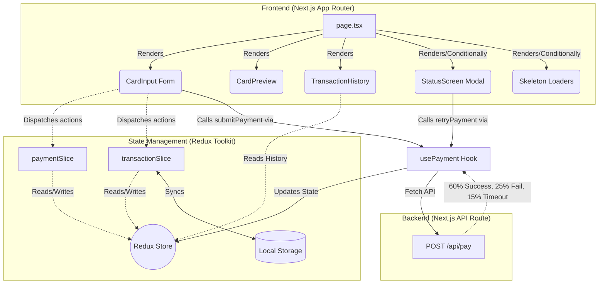

# 💳 Obsidian Prime Terminal - Mock Payment Gateway

## 🌟 Overview
Obsidian Prime Terminal is a highly-polished, enterprise-grade mock payment gateway UI built using **Next.js 14**, **TypeScript**, **Redux Toolkit**, and **Tailwind CSS**. It simulates the entire lifecycle of a payment transaction—from client-side validation to backend simulation—featuring a premium dark-mode, glassmorphism aesthetic.

## 🚀 Key Features
- **Real-Time Validation**: Instant field validation (Luhn algorithm for CC, MM/YY expiry format, CVV checks).
- **Interactive Card Preview**: Live visual representation of the credit card that updates as the user types, adapting to Visa, Mastercard, and Amex.
- **Robust Payment Lifecycle**: Simulates Idle, Processing, Success, Failed, and Timeout states.
- **Retry Mechanism**: Allows up to 3 retries for a failed transaction using the same Transaction ID.
- **Persistent Transaction Ledger**: Stores transaction history in `localStorage` with detailed failure reasoning.
- **Accessibility (a11y) First**: Full ARIA support (`aria-describedby`, `aria-invalid`), screen-reader friendly labels, and focus management.
- **Premium UI/UX**: Skeleton loading states, glassmorphism panels, CSS micro-animations, and dynamic visual feedback.

---

## 🏗️ Architecture

The application is structured into clear layers separating UI, State, and Business Logic:

### Architecture Diagram


### Tech Stack
- **Framework:** Next.js 14 (App Router)
- **Language:** TypeScript
- **State Management:** Redux Toolkit (RTK)
- **Styling:** Tailwind CSS + Vanilla CSS (`globals.css`)
- **Icons:** Lucide-React
- **Animations:** CSS Keyframes & Tailwind utility classes

---

## 📂 Project Structure
```text
src/
├── app/
│   ├── api/pay/route.ts      # Mock backend simulating network latency & outcomes
│   ├── globals.css           # Global styles, Tailwind directives, glassmorphism CSS
│   ├── layout.tsx            # Root layout with Redux Provider integration
│   └── page.tsx              # Main UI assembly & Skeleton loading state
├── components/
│   ├── CardInput.tsx         # Payment form with real-time validation
│   ├── CardPreview.tsx       # Live interactive credit card visualization
│   ├── StatusScreen.tsx      # Modal for Processing/Success/Failure states
│   ├── TransactionHistory.tsx# Transaction ledger UI
│   └── ErrorBoundary.tsx     # React Error Boundary for app stability
├── hooks/
│   ├── usePayment.ts         # Core business logic for API communication & aborts
│   ├── useAppDispatch.ts     # Typed Redux hook
│   └── useAppSelector.ts     # Typed Redux hook
├── store/
│   ├── index.ts              # Redux store configuration
│   ├── paymentSlice.ts       # Manages current payment lifecycle state
│   └── transactionSlice.ts   # Manages the historical ledger of transactions
├── types/
│   └── index.ts              # Global TypeScript interfaces & types
└── utils/
    ├── validation.ts         # Luhn algorithm, date checks, CVV validation
    ├── cardUtils.ts          # Card formatting, type detection (Visa, MC, Amex)
    └── storage.ts            # LocalStorage wrappers for persistence
```

---

## 🔧 Setup & Installation

1. **Clone the repository:**
   ```bash
   git clone https://github.com/KIET7UKE/payment-gateway.git
   cd payment-gateway
   ```

2. **Install dependencies:**
   ```bash
   npm install
   ```

3. **Run the development server:**
   ```bash
   npm run dev
   ```

4. **Open the App:** Navigate to [http://localhost:3000](http://localhost:3000)

---

## 🧪 Testing Guide & Card Examples

You can test the form using the following simulated card credentials. The mock backend randomly assigns a status to each submission regardless of the card used.

### Test Cards (Client-Side Validation Passes)

| Card Network | Card Number          | Expiry | CVV  |
|--------------|----------------------|--------|------|
| **Visa**     | `4111 1111 1111 1111`| `12/28`| `123`|
| **Mastercard**| `5555 5555 5555 5555`| `05/29`| `456`|
| **Amex**     | `3782 822463 10005`  | `10/27`| `1234`|

### Mock Gateway Outcomes
The backend endpoint (`/api/pay`) uses strict probability to simulate real-world API responses on every POST request:
- 🟢 **Success (60%)**: Resolves smoothly after 1.5 seconds.
- 🔴 **Failed (25%)**: Rejects after 1.5 seconds with a random reason (e.g., "Insufficient funds", "Card declined").
- 🟡 **Timeout (15%)**: The backend intentionally hangs for 8 seconds. The frontend safely catches this via `AbortController` after 6 seconds and treats it as a timeout.

---

## 🛠️ Micro-Interactions & Details
- **Skeleton Loaders:** Prevents hydration mismatch and provides a premium "boot-up" feel on initial page load.
- **Number Formatting:** The card number input automatically spaces itself (`XXXX XXXX XXXX XXXX`) as the user types without breaking backspace functionality.
- **Negative Number Blocking:** The amount input explicitly ignores the `-` key and has hidden CSS spinners to look like a clean text input.
- **Strict Vercel Timings:** Added `vercel.json` and explicit `maxDuration` in the API route to ensure serverless functions don't prematurely kill the 8-second simulated timeout.
- **Focus Management:** Upon payment failure or timeout, clicking "Retry" or "Return to Form" automatically sets focus back to the first input field for rapid UX.

---

## 🔮 Future Roadmap
- **Real Tokenization:** Replacing the mock endpoint with Stripe Elements or a PCI-compliant vault.
- **Internationalization (i18n):** Multi-currency support and localized formatting based on user geolocation.
- **Comprehensive Test Coverage:** Implementing Jest for unit logic and Playwright for E2E user flow simulation.
